# Entendendo e Dominando PHP
### PHP 5 Objects, Patterns, Practice
```php
Autor = Matt Zandstra
```
---

## Introdução
### PHP: Projeto e gerência

O conceito de padrão de projeto como uma forma de descrever um problema com a essência de sua solução foi discutido pela primeira vez em 1970.

A ideia foi desenvolvida no campo da arquitetura.

No início da década de 1990, os programadores orientados a objetos estavam utilizando a mesma técnica para nomear e descrever problemas de projeto de software.

A Programação eXtrema (XP), advogada por Kent Beck, é um tipo de abordagem a projetos que incentiva o planejamento e a execução flexíveis, orientatos a objeto e altamente enfocados.

Na XP os testes são cruciais ao sucesso de um projeto. Os testes devem ser automatizados, executados frequentemente e, de preferência, projetados antes que o código alvo seja escrito.

Um dos princípios da XP amplamente aproveitados foi a revisão de código (refatoração). Ela foi um auxiliar poderoso para os padrões.

A importância dos testes automatizados foi ainda mais destacada pelo lançamento da poderosa plataforma de testes JUnit (Java).

Livros:
1. *Design Patterns: Elements of Reusable Object-Oriented Software*, escrito pela Gang of Four, e publicado em 1995.
2. *The Pragmatic Programmer*, de Andrew Hunt e David Thomas, publicado em 2000.
3. *Refactoring: Improving the Design of Existing Code*, escrito por Martin Fowler, publicado em 1999 e que definiu a área de refatoração de código.

Artigos:
1. *Test Infected: Programmers Love Writing Tests*, de Kent Beck e Erich Gamma. Leia: [Source Forge - Test Infected](http://junit.sourceforge.net/doc/testinfected/testing.htm)
2. Leo Atkinson escreveu sobre PHP e padrões para a ZEND em 2001.
3. Harry Fuecks lançou seu [diário](http://www.phppatterns.com) em 2002.

## Objetos

### Fundamentos de objetos

Classes são frequentemente definidas em termos de objetos. Isso é interessante porque objetos são, muitas vezes, definidos em termos de classes.

Classe é um modelo de código usado para gerar objetos. Exemplo de classe:

```php
class ShopProduct {
    // corpo da classe
}
```

Objeto são dados estruturados de acordo com o modelo definido em uma classe. Um objeto é chamado de instância de sua classe. Ele é do tipo definido pela classe.

A classe `ShopProduct` é como um molde para gerar objetos `ShopProduct`. Para tanto, é necessário o operador `new`. Exemplo:

```php
$product1 = new ShopProduct();
$product2 = new ShopProduct();
```

Os objetos criados são funcionalmente idênticos (ou seja, vazios), mas são objetos diferentes do mesmo tipo, gerados a partir de uma única classe.

#### Configurando propriedades em uma classe

Classes podem definir variáveis especiais chamadas propriedades. Uma propriedade, também conhecida como variável membro, armazena dados que podem variar de objeto para objeto.

Uma propriedade em  uma classe se diferencia de uma variável padrão pelo fato de sua declaração e atribuição ser precedida por uma palavra-chave de acesso. Ela pode ser `public`, `protected` ou `private` e determina o escopo a partir da propriedade que pode ser acessada.

> Observação: escopo refere-se ao contexto da função ou da classe em que a variável possui significado. Assim, uma variável definida em uma função existe em escopo local e uma variável definida fora da função existe em escopo global. Como uma regra básica, não é possível acessar dados definidos em um escopo que seja mais local do que o corrente, ou seja, a variável de dentro de uma função não pode ser acessada de fora dela. Os objetos são mais permeáveis, no sentido em que algumas variáveis objeto podem, às vezes, ser acessadas a partir de outros contextos. Quais variáveis podem ser acessadas em qual contexto são determinadas pelas palavras-chave `public`, `protected` e `private`.

O exemplo abaixo mostra quatro propriedades com um valor padrão atribuído a cada uma delas.

```php
class ShopProduct {
    public $title = "default product";
    var $producerMainName = "main name";
    private $producerFirstName = "first name";
    protected $price = 0;
}
```

A palavra-chave `public` assegura que se pode acessar a propriedade de fora do contexto do objeto. Acesso público é a configuração padrão para métodos (que será visto mais a frente) e para propriedades se for usada a antiga palavra-chave `var` na sua declaração de propriedade.

Um método ou propriedade privados só podem ser acessados dentro da classe. Até mesmo subclasses (classe-filha) não têm acesso.

Um método ou propriedade protegidos só podem ser acessados de dentro da classe ou de uma subclasse. Nenhum código externo pode acessá-los.

O controle de acesso permite expor apenas aqueles aspectos de uma classe que sejam requeridos por um cliente. Isso estabelece uma interface clara para o seu objetivo.

Evitando que um cliente acesse determinadas propriedades, o controle de acesso também ajuda a evitar falhas no código.

Como uma regra geral, erre para o lado da privacidade. Torne as propriedades privadas ou protegidas primeiro e relaxe sua restrição apenas quando necessário.

#### Trabalhando com métodos

Os métodos permitem aos seus objetos executar tarefas. São funções especiais declaradas dentro de uma classe. Exemplo:

```php
public function myMethod($argument, $another) {
    // ...
}
```

Os métodos podem receber um número de qualificadores, incluindo palavras-chave de controle de acesso. Da mesma forma que as propriedades, os métodos podem ser declarados como `public`, `protected` ou `private`. Declarando um método como `public`, asseguramos que ele possa ser chamado de fora do objeto corrente. Se a palavra-chave de controle de acesso for omitida na sua declaração de método, este será declarado `public` implicitamente.

Na maioria das circunstâncias, um método será chamado usando uma variável objeto na conjunção com `->`, e o nome do método acrescido de parênteses. Exemplo:

```php
$myObj = new MyClass();
$myObj->myMethod("Harry", "Palmer");
```

A pseudo-variável `$this` é o mecanismo por meio do qual uma classe pode se referir a uma instância de objeto. `$this` pode ser entendida como "a instância corrente".

```php
$this->producerFirstName;
```

O trecho acima pode ser traduzido para a propriedade $producerFirstName da instância corrente.

#### Criando um método construtor

Um método construtor é chamado quando um objeto é criado usando o operador `new`. É usado para configurar coisas, assegurando que as propriedades essenciais sejam configuradas e qualquer trabalho preliminar necessário seja completo. O método construtor deve ser nomeado como `__construct()` e pode ou não receber parâmetros.

#### Argumentos e tipos

Todos os dados em PHP possuem um tipo. O tipo determina a forma pela qual os dados podem ser gerenciados nos seus scripts. Em um nível mais alto, entretanto, uma classe define um tipo. Um objeto `ShopProduct`, portanto, pertence so tipo primitivo `object`, mas também pertence ao tipo de classe `ShopProduct`.

Definições de funções e métodos não necessariamente requerem que um argumento seja de determinado tipo. O fato de que um argumento possa ser de qualquer tipo lhe oferece flexibilidade. Pode-se construir métodos que respondam de forma inteligente a diferentes tipos de dados, ajustando a funcionalidade a circunstâncias dinâmicas. Essa flexibilidade também pode causar ambigüidade no código quando um corpo de método espera que um argumento possua um tipo, mas obtém outro.

##### Tipos primitivos

O PHP é uma linguagem fracamente tipada. Isso significa que não há necessidade de que uma variável seja declarada para armazenar determinado tipo de dado.

Isso não significa que o PHP não tenha conceito de tipo. Cada valor que puder ser atribuído a uma variável possui um tipo. Pode-se determinar o tipo do valor de uma variável usando uma das funções de verificação de tipos do PHP. Tipos de primitivos reconhecidos em PHP e suas funções de teste correspondentes:

| Função de verificação de tipo | Tipo | Descrição |
| ---------- | ---------- | ---------- |
| is_bool() | Boolean | Um dos dois valores especiais `true` ou `false`. |
| is_integer() | Integer | Un múmero inteiro. |
| is_double() | Double | Um número de ponto flutuante (um número com ponto decimal). |
| is_string() | String | Dados caracteres. |
| is_object() | Object | Um objeto. |
| is_array() | Array | Uma matriz. |
| is_resource() | Resource | Um manipulador para identificar e trabalhar com fontes externas, como bancos de dados ou arquivos. |
| is_null() | NULL | Um valor não atribuído. |

Verificar o tipo de uma variável pode ser especialmente importante quando você trabalha com argumentos de métodos e funções.

##### Herança

A herança é um mecanismo pelo qual uma ou mais classes podem ser derivadas de uma classe.

Uma classe herdeira de outra é chamada subclasse. Esse relacionamento é muitas vezes descrito em termos de mãe e filhas. Uma classe-filha é derivada de e herda características (propriedades e métodos) da mãe.

A classe-filha geralmente adicionará funcionalidade além da que é fornecida pela sua mãe (também conhecida como superclasse); por esse motivo, uma classe filha é dita "estendendo" sua mãe.

O primeiro passo na construção de uma árvore de herança é encontrar elementos da classe base que não se adaptem juntos, ou que precisem ser manipulados de forma diferente.

Para criar uma classe-filha, deve-se usar a palavra-chave `extends` na declaração da classe. Exemplo:

```php
class CdProduct extends ShopProduct {
    // ...
}
```

Devido ao fato de as classes derivadas não definirem construtores, o construtor da classe-mãe é chamado automaticamente quando são instanciadas. As classes-filhas herdam o acesso a todos os métodos públicos e protegidos da mãe.

Classes derivadas podem estender, mas também alterar a funcionalidade das suas classes-mães. Ao mesmo tempo, cada classe herda as propriedades das suas classes-mães.

Definindo uma classe que estenda outra, assegura-se que um objeto instanciado seja definido pelas características primeiro da classe-filha e depois da classe-mãe.

###### Construtores e herança

Quando se define um construtor em uma classe-filha, torna-se responsável por passar quaisquer argumentos para a mãe. Se não fizer isso, pode acabar com um objeto parcialmente construído.

Para chamar um método em uma classe-mãe, deve-se, primeiro, encontrar uma forma de se referir à própria classe: um "manipulador". O PHP fornece a palavra-chave `parent` para esse propósito.

Para se referir a um método no contexto de uma classe, em vez de em um objeto, usa-se `::` no lugar de `->`. Assim:

```php
parent::__construct()
```

Esse código significa: "Chame o método `__construct()` da classe-mãe".

Cada classe-filha chama o construtor de sua mãe antes de configurar suas próprias propriedades. A classe base agora só conhece seus próprios dados. Classes-filhas geralmente são especializações das suas mães. Como uma regra básica, deve-se evitar dar a classes-mães algum conhecimento especial sobre suas filhas.

###### Chamando um método anulado

A palavra-chave `parent` pode serusada com qualquer método que anule sua contraparte em uma classe-mãe. Quando se anula um método, pode-se não querer suprimir a funcionalidade da mãe, mas sim estendê-la. Pode-se obter isso chamando o método na classe-mãe no contexto corrente do objeto. Exemplo:

```php
// Classe ShopProduct ...
    function getSummaryLine() {
        $base = "{$this->title}" . " ({$this->producerMainName}, ";
        $base .= "{$this->producerFirstName})";

        return $base;
    }

// Classe CdProduct ...
    function getSummaryLine() {
        // Chama o método da classe-mãe antes de prosseguir e adicionar mais dados à string
        $base = parent::getSummaryLine();
        $base .= ": playing time - {$this->playLength})";
        return $base;
    }
```

###### Métodos de acesso

Mesmo quando é preciso trabalhar com valores armazenados pela sua classe, é uma boa ideia negar acesso direto a propriedades, fornecendo métodos que repassem os valores necessários. Tais métodos são conhecidos como métodos de acesso, ou "leitores e gravadores".

Um método de acesso pode ser usado para filtrar um valor de propriedade de acorso com as circunstâncias. Exemplo:

```php
// Classe BookProduct
    function getPrice() {
        return $this->price();
    }
```

Também pode-se usar um método de gravação para impor um tipo de propriedade. Exemplo:

```php
// Classe ShopProductWriter
    private $products = array();

    public function addProduct(ShopProduct $shopProduct) {
        $this->products[] = $shopProduct;
    }

    public function write() {
        // ...
    }
```

Definir a propriedade `$products` como privada torna impossível para o código externo danificá-la pela adição de um tipo de objeto errado. Os acessos acontecem pelo método `addProduct()` e a dica do tipo da classe usada na declaração do método assegura que apenas objetos `ShopProduct` possam ser adicionados à propriedade matriz.

### Recursos avançados

#### Métodos e propriedades estáticos

Até aqui ficou caracterizado que as classes são como modelos a partir dos quais os objetos são produzidos e os objetos como componentes ativos; elementos cujos métodos chamamos e cujas propriedades acessamos. É possível deduzir que a ação na programação orientada a objetos deve ser encontrada pelas instâncias das classes. As classes, afinal, são apenas modelos para objetos.

Na verdade, não é tão simples. Pode-se acessar tanto métodos quanto propriedades no contexto de uma classe, e não de um objeto. Tais métodos e propriedades são "estáticos" e devem ser declarados como tais usando a palavra-chave `static`. Veja:

```php
class StaticExemple {
    static public $aNum = 0;

    static public function sayHello() {
        print "Hello";
    }
}
```

Devido ao fato de acessar um elemento estático por meio de uma classe, e não de uma instância, não há necessidade de uma variável que referencie um objeto. Ao contrário, usa o nome da classe com `::`. Veja:

```php
print StaticExemple::$aNum;
print StaticExemple::sayHello();
```

Para acessar um método ou propriedade estática a partir do interior de uma mesma classe (e não da filha), usa-se a palavra-chave `self`; `self` é para as classes o que a pseudo-variável `$this` é para objetos. Assim, de fora da classe `StaticExemple` acessa-se a propriedade `$aNum` usando seu nome de classe.

De dentro da classe `StaticExemple` pode-se usar a palavra-chave `self`:

```php
class StaticExemple {
    static public $aNum = 0;

    static public function sayHello() {
        self::$aNum++;
        print "Hello (" . self::$aNum . ")\n";
    }
}
```

Por definição, métodos estáticos não são chamados no contexto de um objeto. Daí, não poder usar a pseudo-variável `$this` dentro de um método estático sem causar um erro fatal.

A razão do uso de um método ou propriedade estática consiste:
- primeiro, no fato de que eles estão disponíveis a partir de qualquer lugar no script (presumindo que se tenha acesso à classe). Isso significa que se pode acessar a funcionalidade sem precisar passar uma instância de classe de objeto para objeto, ou, pior ainda, armazenar uma instância em uma variável global.
- segundo, no fato de uma propriedade estática ficar disponível a todas as instâncias de uma classe, de forma que se possa configurar os valores que quiser, desde que fiquem disponíveis para todos os membros de um tipo.
- finalmente, no fato de que não necessita de uma instância para acessar uma propriedade ou método estático pode evitar que se instancie um objeto apenas para obter uma simples função.

#### Propriedades constantes

Algumas propriedades não podem ser alteradas. Sinalizações de erro e de status, muitas vezes, serão codificadas explicitamente nas suas classes. Embora elas devam ser pública e estaticamente disponíveis, o código cliente não deve alterá-las.

O PHP 5 permite que se defina propriedades constantes dentro de uma classe. Da mesma forma que é feito com constantes globais, constantes de classes não podem ser alteradas assim que estiverem configuradas. Uma propriedade constante é declarada com a palavra-chave `const`. As constantes não são prefixadas com um sinal de cifrão, como as propriedades regulares. Por convenção, elas são, muitas vezes, nomeadas usando apenas letras maiúsculas:

```php
class ShopProduct {
    const AVAILABLE = 0;
    const OUT_OF_STOCK = 1;
    // ...
```

Propriedades constantes podem conter apenas valores primitivos. Um objeto não pode ser atribuído a uma constante. As constantes são acessadas por meio da classe, e não por uma instância. Refere-se a uma constante sem um sinal de cifrão:

```php
print ShopProduct::AVAILABLE;
```

Usa-se constantes quando sua propriedade precisa estar disponível por todas as instâncias de uma classe e quando o valor da propriedade precisa ser estabelecido e não mudar.

#### Classes abstratas

Uma classe abstrata não pode ser instanciada. Em vez disso, ela define (e, opcionalmente) a interface de qualquer classe que possa estendê-la.

Uma classe abstrata é definida com a palavra-chave `abstract`. Exemplo:

```php
abstract class ShopProductWriter {
    // ...
}
```

Na maioria dos casos, uma classe abstrata terá pelo menos um método abstrato. Estes são declarados mais uma vez com a palavra-chave `abstract`. Um método abstrato não pode ter uma implementação. Ele é declarado como normal, mas termina com um ponto e vírgula, e não com um corpo de método. Exemplo:

```php
abstract class ShopProductWriter {
    // ...
    abstract public function write();
}
```

Na criação de um método abstrato, assegura-se que uma implementação estará disponível em todas as classes-filhas concretas, mas com os detalhes dessa implementação indefinidos.

Assim, qualquer classe que estenda uma classe abstrata deve implementar todos os métodos abstratos ou deve, ela mesma, ser declarada como abstrata. Uma classe que a estenda é responsável por mais do que simplesmente implementar um método abstrato. Ao fazê-lo, ela deve reproduzir a assinatura do método. Isso significa que o controle de acesso do método implementado não pode ser mais rigoroso do que o do método abstrato. O método implementado também deve requerer o mesmo número de argumentos do método abstrato, reproduzindo todas as dicas de tipos de classe. Exemplo:

```php
abstract class ShopProductWriter {
    // ...
    abstract public function write();
}

class XmlProductWriter extends ShopProductWriter {
    // ...
    public function write() {
        // ...
    }
}

class TextProductWriter extends ShopProductWriter {
    // ...
    public function write() {
        // ...
    }
}
```

#### Interfaces

Enquanto as classes abstratas permitem o fornecimento de alguma medida de implementação, as interfaces são modeos puros. Uma interface só pode definir funcionalidade, nunca pode implementá-la. Uma interface é declarada com a palavra-chave `interface`. Ela pode conter declarações de propriedades e métodos, mas não corpos de métodos. Exemplo:

```php
interface Chargeable {
    public function getPrice();
}
```

Qualquer classe que incorpore essa interface compromete-se a implementar todos os métodos que ela definir e deve ser declarada como abstrata.

Uma classe pode implementar uma interface usando a palavra-chave `implements` na sua declaração. Exemplo:

```php
class ShopProduct implements Chargeable {
    // ...
    public function getPrice() {
        // ...
    }
    // ...
}
```

A implementação de uma interface pode ser útil pelo tipo. Uma implementação de classe recebe o tipo da classe que ela estende e a interface que ela implementa. Assim, uma classe `CdProduct` pertence a:

```
CdProduct
ShopProduct
Chargeable
```

Uma classe pode estender uma superclasse e implementar qualquer número de interfacer. A cláusula `extends` deve preceder a cláusula `implements`:

```php
class Consultancy extends TimedService implements Bookable, Chargeable {
    // ...
}
```

Múltiplas interfaces seguem a palavra-chave `implements` em uma lista separada por vírgulas.

PHP suporta apenas a herança de uma única mãe, de modo que a palavra-chave `extends` só pode preceder um único nome de classe.

#### Manipulação de erros

##### Exceções

Exceções abordam todas as questões que levantamos até agora.

Uma exceção é um objeto especial, instanciado a partir da classe interna `Exception` (ou de uma classe derivada). Objetos do tipo `Exception` são projetados para armazenar e relatar informações sobre erros.

O construtor da classe `Exception` recebe dois argumentos opcionais, uma string de mensagem e um código de erro. A classe fornece alguns métodos úteis para analisar condições de erro, descritos na tabela abaixo:

| Método | Descrição |
| ---------- | ---------- |
| getMessage() | Obtém a string da mensagem passada para o construtor. |
| getCode() | Obtém o código do tipo inteiro passado para o construtor. |
| getFile() | Obtém o arquivo no qual a exceção foi gerada. |
| getTrace() | Obtém uma matriz multidimensional registrando as chamadas ao método que levaram à exceção, incluindo método, classe, arquivo e dados de argumentos. |
| getTraceAsScript() | Obtém uma versão string dos dados retornados por `getTrace()`. |
| __toString() | Chamado automaticamente quando o objeto `Exception` é usado no contexto de string. Retorna uma string descrevendo os detalhes da exceção. |

A classe `Exception` é fantasticamente útil para fornecer notificação de erros e informações para depuração (os métodos `getTrace()` e `getTraceAsString` são especialmente úteis quanto a isso).

###### Gerando uma exceção

A palavra-chave `throw` é usada com um objeto `Exception`. Ela para a execução do método corrente e passa a responsabilidade pela manipulação de erros de volta ao código solicitante. Exemplo:

```php
public function connect() {
    $this->db = Connect::getInstance();
    if (Connect::isError($this->db)) {
        throw new Exception("A connection error occured");
    }
}
```

Ao chamar um método que talvez gere uma exceção, pode-se envolver sua chamada em uma cláusula `try`. Uma cláusula `try` é criada em torno da palavra-chave `try` seguida por chaves. Auma cláusula `try` deve ser seguida por pelo menos uma cláusula `catch` na qual pode-se manipular quaisquer erros, desta forma:

```php
try {
    // ...
} catch (Exception $e) {
    die($e->__toString());
}
```

Quando uma exceção é gerada, a cláusula `catch` no escopo da solicitação e chamada. O objeto `Exception` é automaticamente passado para a variável do argumento.

Assim como a execução é parada dentro do método que gera a exceção, quando uma ocorre, também o é dentro da cláusula `try`; o controle passa diretamente para a cláusula `catch`.

###### Subclasses de exceções

Pode-se criar classes que estendam `Exception` da mesma forma que se faz com qualquer classe definida pelo usuário. Existem duas razões:

- estender a funcionalidade da classe.
- uma classe derivada define um novo tipo de classe que pode ajudar na manipulação de erros.

Pode-se definir quantas cláusulas `catch` precisar para uma declaração `try`. A cláusula `catch` específica depende do tipo da exceção gerada e da dica de tipo de classe na lista de argumentos. Exemplo:

```php
class DbException extends Exception {
    // ...
}

class DbConnectionException extends DbException {}
class SqlException extends DbException {}
```

Uma abordagem que pode gerar uma exceção implícita ou escondida tende a dificultar o rastreamento do que está acontecendo no código. Veja:

```php
// Classe PersonPersist ...
    public function connect() {
        $this->db = Connect::getInstance();
        if (Connect::isError($this->db)) {
            throw new Exception("A connection error occured");
        }
    }

    public function insert(Person $person) {
        if (empty($this->db)) {
            $this->connect();
        }

        // ...

        if (Connect::isError($insert_result)) {
            throw new SqlException($insert_result);
        }

        // ...
    }
}
```

Uma outra abordagem é explícita. Usar o par `try/catch` é redundante, mas possui a virtude da clareza. Veja:

```php
public function insert(Person $person) {
    try {
        if (empty($this->db)) {
            $this->connect();
        }
    } catch (DbConnectionException $e) {
        throw $e;
    }
    // ...
}
```

Gerando uma de duas possíveis exceções:

```php
try {
    $saver = new PersonPersist("sqlite:./persons.db");
    $saver->insert($person);
} catch (DbConnectionException $e) {
    // Erro de conexão:
    // Talvez tentar novamente com um novo Data Source Name
    print $e->__toString();
}
} catch (SqlException $e) {
    // Erro durante a inserção
    // Tabela não existe ou o seu esquema não equivale aos campos
    print $e->__toString();
}
} catch (Exception $e) {
    // Não deveria ser chamada corretamente
    print $e->__toString();
}
```

A cláusula chamada depende do tipo da exceção gerada. O primeiro equivalente será executado, então, é importante colocar o tipo mais genérico no final e o mais especializado no início.

Uma exceção deve ser gerada quando um método tiver detectado um erro, mas não possuir informação contextual para poder manipulá-la e forma inteligente.

#### Classes e métodos finais

A herança permite enorme flexibilidade dentro de uma hierarquia de classes. Às vezes, no entanto, uma clásse ou método deve permanecer sem mudanças. Se já se tem a funcionalidade definitiva para uma classe, ou método, e sobrescrevê-la pode apenas danificar a perfeição do seu trabalho, talvez precise da palavra-chave `final`, que coloca um final na herança. Uma classe `final` não pode ter subclasses. Menos dramaticamente, um método `final` não pode ser sobrescrito. Exemplo:

```php
final class Checkout {
    // ...
}
```

Qualquer tentativa de driar uam subclasse da classe `Checkout` causará um erro fatal.

Pode-se relaxar um pouco e declarar um método `final` em `Checkout`, em vez de fazê-lo com a classe inteira. A palavra-chave `final` deve ser colocada na frente de quaisquer modificadores, como `protected` ou `static`.

```php
class Checkout {
    final function totalize() {
        // ...
    }
}
```

Um bom código orientado a objetos tende a enfatizar a interface bem definida. Por trás da interface, entretanto, as implementações muitas vezes variarão. Diferentes classes ou combinações de classes adaptam-se a interfaces comuns, mas se comportam de forma diferente em situações diferentes. Declarando uma classe ou método como `final`, essa flexibilidade é limitada. Contudo, deve-se pensar com cautela antes de declarar algo como `final`.

#### Trabalhando com interceptadores

O PHP fornece métodos interceptadores internos, que podem interceptar mensagens enviadas para métodos e propriedades não definidas. Isso também é conhecido como "sobrecarga", ma, já que esse termo significa algo bastante diferente em Java e C++, melhor falar em termos de interceptação.

O PHP 5 suporta três métodos internos de sobrecarga. Como o `__construct()`, eles são chamados quando as condições corretas são satisfeitas.

| Método | Descrição |
| ---------- | ---------- |
| `__get($property)` | Chamado quando uma propriedade indefinida é acessada. |
| `__set($property, $value)` | Chamado quando um valor é atribuído e uma propriedade indefinida. |
| `__call($method, $arg_array)` | Chamado quando um método indefinido é habilitado. |

Os métodos `__get()` e `__set()` são projetados para trabalhar com propriedades que não tiverem sido declaradas em uma classe (ou nas suas ancestrais).

O `__get()` é chamado quando o código cliente tenta ler uma propriedade não delcarada. Ele é chamado automaticamente com um único argumento string contendo o nome da propriedade que o cliente estiver tentando acessar. O que quer que se retorne do método `__call()` será enviado para o cliente como se a propriedade alvo existir com esse valor.

```php
class Person {
    function __get($property) {
        $method = "get{$property}";
        if (method_exists($this, $method)) {
            return $this->$method;
        }
    }

    function getName() {
        return "Bob";
    }

    function getAge() {
        return 43;
    }
}
```

O método `__set()` é chamado quando o código cliente tenta atribuir a uma propriedade não definida. Ele recebe dois argumentos: o nome da propriedade e o valor que o cliente está tentando gravar. Pose-se, então, decidir como trabalhar com esses argumentos. Veja:

```php
class Person {
    private $_name;
    private $_age;

    function __set($property, $value) {
        $method = "set{$property}";
        if (method_exists($this, $method)) {
            return $this->$method($value);
        }
    }

    function getName($name) {
        $this->_name = strtoupper($name);
    }

    function getAge($age) {
        $this->_age = strtoupper($age);
    }
}
```

O método `__call()` é, provavelmente, o mais útil de todos os métodos interceptadores. Ele é chamado quando um método não definido é habilitado pelo código cliente. O `__call()` é chamado com o nome do método e uma matriz que armazena todos os argumentos passados pelo cliente. Qualquer valor que você retorne do método `__call()` é retornado para o cliente como se tivesse sido feito pelo método chamado.

O método `__call()` pode ser útil para a delegação. Delegação é o mecanismo por meio do qual um objeto passa chamadas de métodos. Ele é semelhante à herança no sentido em que uma classe-filha passa uma chamada de método para sua implementação ancestral. Com herança, o relacionamento entre filha e mãe é fixo, então, o fato de que você pode alternar o objeto recebido em tempo de execução significa que a delegação pode ser mais flexível do que a herança. Veja uma classe para formatar informações da classe `Person`:

```php
class PersonWriter {
    function writeName(Person $p) {
        print $p->getName() . "\n";
    }

    function writeAge(Person $p) {
        print $p->getAge() . "\n";
    }
}
```

Veja a implementação da classe `Person`:

```php
class Person {
    private $writer;

    function __construct(PersonWriter $writer) {
        $this->writer = $writer;
    }

    function __call($methodname, $args) {
        if (method_exists($this->writer, $methodname)) {
            return $this->writer->$methodname($this);
        }
    }

    function getName() {return "Bob";}
    function getNAge() {return 44;}
}
```

A classe `Person` demanda um objeto `PersonWriter` como argumento do construtor e o armazena em uma variável de propriedade. No método `__call()`, usa-se o argumento `$methodname` fornecido, testando um método do mesmo nome no objeto `PersonWriter` que armazenamos. Se o método for encontrado, delega-se a chamada do método ao objeto `PersonWriter`, passando a instância corrente para ele (na pseudo-variável `$this`). Assim, o cliente faz a chamada a `Person`:

```php
$person = new Person(new PersonWriter());
$person->writeName();
```

O método `__call()` é chamado. Um método chamado `writeName()` é encontrado no seu objeto `PersonWriter` e o é chamado. Isso evita que o método delegado seja chamado manualmente. Veja:

```php
function writeName() {
    $this->writer->writeName($this);
}
```

A classe `Person` ganhou dois novos métodos. Embora a delegação automatizada possa economizar  muito trabalho, caso se precise delegar para muitos métodos, há um custo quanto à clareza. Apresenta-se ao mundo uma interface dinâmica que resistirá à reflexão (o exame de tempo de execução de aspectos de classe) e não será clara para o codificador cliente à primeira vista. Os métodos interceptadores possuem seu lugar, mas devem ser usados com cautela. As classes que se baseiam neles devem documentar esse fato com muita clareza.

#### Definindo métodos destrutores

O método `__destruct()` é chamado antes de um objeto sofrer a coleta de lixo, ou seja, antes de ser apagado da memória. Esse método pode ser usado para executar qualquer limpeza que possa ser necessária.

Numa classe que grava a si mesma num banco de dados, quando for solicitada, pode-se usar o método `__destruct()` para assegurar que essa instância grave seus dados quando for apagada:

```php
class Person {
    // ...
    function __destruct() {
        if (!empty($this->id)) {
            // save Person data
            print "saving person\n";
        }
    }
}
```

O método `__destruct()` é chamado sempre que um objeto for removido da memória. Isso acontecerá quando a função `unset()` com o objeto em questão for chamada ou quando nenhuma referência ao objeto existir no processo. Exemplo:

```php
$person = new Person("Bob", 44);
$person->setId(343);
unset($person);
// saída:
// gravando $person
```

#### Copiando objetos com __clone()

O PHP 5 fornece a palavra-chave `clone` apenas para as ocasiões em que houver a necessidade de se obter uma cópia de um objeto, em vez de uma referência a ele.

O `clone` opera sobre uma instância de objeto, produzindo uma cópia por valor:

```php
class Person {}
$p1 = new Person("Bob", 44);
$p2 = clone $p1;
// Agora, $p2 e $p1 são 2 objetos distintos
```

Não é tudo. A cópia do objeto `$p1` conteria o identificador (a propriedade `$id`) que em uma implementação integral seria usada para localizar o registro em um banco de dados. Uma alteração num objeto afetará o outro, e vice-versa.

Felizmente, pode-se controlar o que é copiado quando um `clone` é chamado sobre um objeto. Isso é feito implementando um método especial chamado `__clone()`. O `__clone()` é chamado automaticamente quando a palavra-chave é chamada em um objeto.

Quando `__clone()` é implementado é importante compreender que ele é executado sobre o objeto copiado e não sobre o original. 

```php
class Person {
    // ...
    function __clone() {
        $this->id = 0;
    }
}
```

Quando `clone` é chamado sobre um objeto `Person`, uma nova cópia superficial é feita, e seu método `__clone()` é chamado. Isso significa que qualquer coisa que se faça em `__clone()` sobrescreve a cópia padrão já feita. No exemplo, o `$id` do objeto copiado será zero:

```php
$person = new Person("Bob", 44);
$person->setId(343);
$person2 = clone $person;
// $person2 :
//  name: Bob
//  age: 44
//  id: 0
```

Uma cópia superficial assegura que propriedades primitivas sejam copiadas do objeto antigo para o novo. Propriedades de objetos são copiadas por referência, o que pode não ser o que se espera ao clonar um objeto. Considere-se que o objeto `Person` tenha uma propriedade de objeto `Account`. Esse objeto armazena um saldo que se queira copiar para o objeto clonado. O que não se quer é que ambos os objetos `Person` armazenem referências para a mesma conta:

```php
class Account {
    public $balance;
    function __construct($balance) {
        $this->balance = $balance;
    }
}

class Person {
    private $name;
    private $age;
    private $id;
    private $account;

    function __construct($name, $age, Account $account) {
        $this->name = $name;
        $this->age = $age;
        $this->account = $account;
    }

    function setId($id) {
        $this->id->$id;
    }

    function __clone() {
        $this->id = 0;
    }
}

$person = new Person("Bob", 44, new Account(200));
$person->setId(343);
$person2 = clone $person;

// dá a $person algum dinheiro
$person->account->balance += 10;
// $person2 vê o crédito também
print $person2->account->balance;

// saída:
// 210
```

Para que uma propriedade de objeto não seja compartilhada após uma operação de clonagem é necessário cloná-la explicitamente no método `__clone()`:

```php
function __clone() {
    $this->id = 0;
    $this->account = clone $this->account;
}
```

#### Definindo valores de strings para seus objetos

Implementando o método `__toString()`, pode-se controlar a forma pela qual seus objetos representam a si próprios ao serem imprimidos. O `__toString()` deve ser escrito para retornar um valor string. O método é chamado automaticamente quando seu objeto é passado para `print` ou `echo` e seu valor de retorno é subtituído. Adicionando uma versão `__toString()` à uma classe `Person` mínima:

```php
class Person {
    function getName() {return "Bob";}
    function getAge() {return 44;}
    function __toString() {
        $desc = $this->getName();
        $desc .= " (age " . $this->getAge() . ")";
        return $desc;
    }
}

$person = new Person();
print $person;
// saída:
// Bob (age 44)
```

O método `__toString()` é especialmente para registros e relatórios de erros e para classes cuja tarefa principal seja mostrar informaçnoes. A classe `Exception`, por exemplo, resume os dados da exceção no seu método `__toString()`.

### Ferramentas de objetos

#### As funções de classes e objetos

O PHP fornece um conjunto poderoso de funções para testar classes e objetos.

##### Procurando classes

```php
// tasks/Task.php
class Task {
    function doSpeak() {
        print "hello";
    }
}

// TaskRuner.php
$classname = "Task";
$path = "task/$classname.php";
if (!file_exists($path)) {
    throw new Exception("No such file as $path");
}

require_once($path);
if (!class_exists($classname)) {
    throw new Exception("No such class as $path");
}

$myObj = new $classname();
$myObj->doSpeak();
```

##### Adquirindo conhecimentos sobre um objeto ou classe

Pode-se restringir os tipos de argumentos de métodos usando dicas de tipos de classes. Mesmo com essa ferramenta, nem sempre se opde ter certeza do tipo de um objeto.

Há um número de ferramentas básicas disponíveis para verificar o tipo de um objeto. Em primeiro lugar, pode-se verificar a classe de um objeto com a função `get_class()`. Ela recebe qualquer objeto como argumento e retorna seu nome de classe na forma de string:

```php
$product = getProduct();
if (get_class($product) == 'CdProduct') {
    print "\$product is a CdProduct object\n";
}
```

A função `get_class()` é uma ferramenta muito específica. É possível querer saber apenas se um objeto pertence a uma determinada família, no caso `ShopProduct`, mas não se sua classe real seria `BookProduct` ou `CdProduct`. A função `is_a()`, que requer um objeto e o nome de uma classe ou interface, retorna `true` se o objeto for uma instância de determinado tipo. Veja:

```php
$product = getProduct();
if (is_a($product, 'ShopProduct')) {
    print "\$product is a ShopProduct object\n";
}
```

O mecanismo Zend 2 suporta a palavra-chave `instanceof`. Esse operador funciona com dois operandos, o objeto a ser testado, à esquerda da palavra-chave, e o nome da classe ou interface, à direita:

```php
$product = getProduct();
if ($product instanceof ShopProduct) {
    print "\$product is a ShopProduct object\n";
}
```

Prefira usa `instanceof` no lugar de `is_a()`.

##### Adquirindo conhecimentos sobre métodos

Pode-se obter uma lista de todos os métodos de uma classe usando a função `get_class_methods()`. Ela quer um nome de classe e retorna uma matriz com nomes de todos os métodos da classe:

```php
print_r(get_class_methods('CdProduct'));
/*
Array
(
    [0] => __construct
    [1] => getPlayLength
    [2] => getSummaryLine
    [3] => getProducerFirstName
    [4] => getProducerMainName
    [5] => setDiscount
    [6] => getDiscount
    [7] => getTitle
    [8] => getProce
    [9] => getProducer
)
*/
```

Recebendo um nome de método em uma variável string e chamando ,dinamicamente, com um objeto:

```php
$product = getProduct(); // obtém um objeto
$method = "getTitle"; // define um nome de objeto
print $product->$method(); // chama o método
```

Isso pode ser perigoso, pois o método pode não existir. Veja uma forma de testar se o método existe:

```php
if (in_array($method, get_class_methods($product))) {
    print $product->$method(); // chama o método
}
```

Verifica se o nome do método existe na matriz retornada por `get_class_methods()` antes de chamá-la. O PHP fornece mais ferramentas especializadas com esse propósito: 

- `is_callable()`: é a mais sofisticada. ELa recebe uma variável string representando um nome de função como primeiro argumento e retorna `true` se a função existir e puder ser chamada. Para aplicar o mesmo teste a um método, deve-se passar uma matriz no lugar do nome da função. A matriz deve conter um objeto ou nome de classe como seu primeiro elemento e o nome do método a ser verificado como seu segundo elemento. A função retornará `true` se o método existir. A `is_callable()` opcionalmente recebe um segundo argumento: um booleano. Se configurá-lo como `true`, a função verificará apenas a sintaxe do nome de método ou da função, e não a sua existência. Exemplo:

```php
if (is_callable(array($product, $method))) {
    print $product->$method(); // invoke method
}
```

- `method_exists()`: requer um objeto e um nome de método e retorna `true` se o dado método existir na classe do objeto:

```php
if (method_exists($product, $method)) {
    print $product->$method(); // invoke method
}
```

O método `method_exists()` não recebe um nome de classe como seu primeiro argumento; deve-se usar um objeto. Caso não tenha um objeto, pode-se contornar essa limitação usando `get_class_methods()` ou `is_callable()`, pois ambas recebem nomes de classes:

```php
if (in_array($method, get_class_methods('CdProduct'))) {
    // ...
}
```

##### Adquirindo conhecimentos sobre propriedades

As propriedades de uma classe também podem ser consultadas. A função `get_class_vars()` requer um nome de classe e retorna uma matriz associativa. A matriz retornada contém nomes de campos, como suas chaves e valores de campos.

```php
print_r(get_class_vars('CdProduct'));
Array
(
    [playLength] => 0
    [coverUrl] =>
    [price] =>
)
```

Essa função retorna apenas as propriedades visíveis à classe. Portanto, é importante ter atenção à privacidade. Ela não informa, entretanto, quais propriedadesão acessíveis, informando as propriedades `protected`, `private` e `public`, sem distinção.

##### Adquirindo conhecimentos sobre herança

As funções de classe também permite mapear relacionamentos de herança. Pode-se encontrar a classe-mãe de uma classe com `get_parent_class()`. Essa função requer um objeto ou 
um nome de classe e retorna o nome da superclasse, se houver alguma. Se não houver, retorna `false`:

```php
print get_parent_class('CdProduct');
// ShopProduct
```

Pode-se testar se uma classe é filha de outra u
sando a função `is_subclass_of()`. Ela requer um objeto-filho e o nome da classe-mãe. A função retorna `true` se o segundo argumento for uma superclasse do primeiro:

```php
$product = getProduct(); // obtém um objeto
if (is_subclass_of($product, 'ShopProduct')) {
    print "CdProduct is a subclass of ShopProduct\n";
}
```

##### Chamada de método

O PHP oferece o método `call_user_func()` que tem a finalidade de usar uma string para chamar um método dinamicamente. Ele pode chamar métodos e funções. Para chamar uma função, ele requer uma única string, como seu primeiro argumento:

```php
$returnVal = call_user_func("myFunction");
```

Para chamar um método, ele requer uma matriz. O primeiro elemento deve ser um objeto e o segundo, o nome do método a ser chamado:

```php
$returnVal = call_user_func(array($myObj, "methodName"));
```

Pode-se passar quaisquer argumentos que o método ou função requeira em argumentos adicionais para `call_user_func()`:

```php
$product = getProduct(); // obtém um objeto
call_user_func(array($product, 'setDiscount'), 20);
// equivale a: $product->setDiscount(20);
```

Muito mais impressionante, porém, é a função relacionada `call_user_func_array()`. Ela opera da mesma forma que `call_user_func()` no que diz respeito à seleção do método ou função alvo. Crucialmente, entretanto, ela recebe quaisquer argumentos requeridos pelo método alvo na forma de uma matriz.

```php
function __call($method, $args) {
    if (method_exists($this->thirdpartyShop, $method)) {
        return call_user_func_array(
            array($this->thirdpartyShop->$method, $args);
        );
    }
}
```

#### A API de reflexão

A API de reflexão consiste em classes internas para analisar propriedades, métodos e classes. É semelhante, em alguns aspectos, a funções de objetos existentes, como `get_class_vars()`, mas é mais flexível e fornece maiores detalhes. Também é projetada para trabalhar com recursos orientados a objetos, como controle de acesso e classes abstratas.

##### Iniciando

A API de reflexão pode ser usada para examinar mais do que classes. A tabela abaixo lista algumas das classes da API:

| Classe | Descrição |
| ---------- | ---------- |
| `Reflection` | Fornece um método estático `export()` para resumir informações sobre classes |
| `ReflectionClass` | Ferramentas e informações sobre classes |
| `ReflectionMethod` | Ferramentas e informações sobre métodos de classes |
| `ReflectionParameter` | Informações sobre argumentos de métodos |
| `ReflectionProperty` | Informações sobre propriedades de classes |
| `ReflectionFunction` | Ferramentas e informações sobre funções |
| `ReflectionExtension` | Informações sobre extensão PHP |
| `ReflectionException` | Uma classe de erros |

As classes da API de reflexão fornecem acesso, em tempo de execução, e sem precedentes, sobre os objetos, funções e extensões nos scripts.

A preferência de uso da API de reflexão está com funções de objetos e classes. É indispensável como derramenta para testar classes. Talvez queira gerar diagramas de classes ou documentação, por exemplo, ou ainda, gravar as informações dos objetos em um banco de dados, e examinar os métodos de acesso de um objeto para extrair nomes de campos. Até construir `framework` que chame métodos de classes de acordo com um esquema de nomeclatura pode ser uso da reflexão. Exemplo:

O cons trutor de `ReflectionClass` recebe um nome de classe como seu único argumento:

```php
$prod_class = new ReflectionCLass('CdProduct');
Reflection::export($prod_class);

// veja um trecho da saída gerada pela chamada Reflectio::export($prod_class);
Class [<user> class CdProduct extends ShopProduct ] {
    @@ /home/projects/sp/ShopProduct.php 59-80

    - Constants [0] {
    }

    - Static properties [0] {
    }

    - Static methods [0] {
    }

    - Properties [3] {
        Property [<default> private $playLength]
        Property [<default> public $coverUrl]
        Property [<default> protected $price]
    }

    - Methods [11] {
        Method [<user> <ctor> public method __construct] {
            @@ /home/projects/sp/ShopProduct.php 63-68

            - Parameters [5] {
                Parameter #0 [$title]
                Parameter #1 [$firstName]
                Parameter #2 [$mainName]
                Parameter #3 [$price]
                Parameter #4 [$playLength]
            }
        }

        Method [<user> public method getPlayLength] {
            @@ /home/projects/sp/ShopProduct.php 70-72
        }

        Method [<user> public method getSummaryLine] {
            @@ /home/projects/sp/ShopProduct.php 74-78
        }
}
```

A função `var_dump()` é uma ferramenta de propósito geral, para resumir dados. Juntamente com `print_r()`, seu primo, são ferramentas fantasticamente convenientes para expor os dados nos scripts. Para classes e funções, a API de reflexão leva tudo, porém, a um novo nível.

###### Um exemplo

```php
class Person {
    public $name;
    function __construct($name) {
        $this->name = name;
    }
}

interface Module {
    function execute();
}

class FtpModule implements Module {
    function setHost($host) {
        print "FtpModule::setHost(): $host\n";
    }

    function setUser($user) {
        print "FtpModule::setUser(): $user\n";
    }

    function execute() {
        // do things
    }
}

class PersonModule implements Module {
    function setPerson(Person $person) {
        print "PersonModule::setPerson(): {$person->name}\n";
    }

    function execute() {
        // do things
    }
}

class ModuleRunner {
    private $configData = array(
        "PersonModule" => array('person' => 'Bob'),
        "FtpModule" => array('host' => 'exemple.com', 'user' => 'anon')
    );
    private $modules = array();
    
    function init() {
        $interface = new ReflectionClass('Module');
        foreach ($this->configData as $modulename => $params) {
            $module_class = new ReflectionClass($modulename);
            if (!$module_class->isSubclassOf($interface)) {
                throw new Exception("unknown module type: $modulename");
            }
            $module = $module_class->newInstance();
            foreach ($module_class->getMethods() as $method) {
                $this->handleMethod($module, $method, $params);
                // we cover handleMethod() in a future listing!
            }
            array_push($this->modules, $module);
        }
    }

    function handleMethod(Module $module, ReflectionMethod $method, $params) {
        $name = $method->getName();
        $args = $method->getParameters();

        if (count($args) != 1 || substr($name, 0, 3) != "set") {
            return false;
        }

        $property = strtolower(substr($name, 3));
        if (!isset($params[$property])) {
            return false;
        }

        $arg_class = $args[0]->getClass();
        if (empty($arg_class)) {
            $method->invoke($module, $params[$property]);
        } else {
            $method->invoke($module, $arg_class->newInstance($params[$property]));
        }
    }
}

$test = new ModuleRunner();
$test->init();
```

### Objetos e projetos

#### Definindo o projeto do código

Um "projeto de código" relaciona-se à definição de um sistema: a determinação dos requisitos de um sistema, seu escopo e seus objetivos. O que o sistema faz? Para quem ele precisa fazer isso? Quais são as saídas do sistema? Elas satisfazem às necessidades declaradas? Em um nível mais baixo, o projeto pode ser considerado como o sentido do processo por meio do qual você define os participantes de um sistema e organiza seus relacionamentos. A preocupação aqui vai ser com o segundo sentido: a definição e disposição de classes e objetos.

Então, o que é um participante? Um sistema orientado a objetos é constituído de classes. É importante decidir a natureza desses participantes no sistema. Classes são constituídas de métodos, então, na definição das suas classes, deve-se decidir quais métodos devem ficar juntos. Será visto, entretanto, que as classes são, muitas vezes, combinadas em relacionamentos de herança para se adaptarem a interfaces comuns. São essas interfaces, ou tipos, que devem ser a primeira parada no projeto do sistema.

Há outros relacionamentos que se pode definir para suas classes. É possível criar classes que sejam compostas por outros tipos, ou que gerenciem listas de outras instâncias de tipos. Pode-se projetar classes que, simplesmente, usem outros objetos. Esses relacionamentos de composição, ou uso, são projetados nas suas classes (através de dicas de tipos de classes, por exemplo), mas os relacionamentos reais dos objetos ocorrem em tempo de execução, o que pode adicionar flexibilidade ao projeto. Será visto como modelar esses relacionamentos logo mais.

Como parte do processo de projeto, deve-se decidir quando uma operação deve pertencer a um tipo e quando ela deve pertencer a outra classe usada pelo tipo.

#### Programação procedural e orientada a objetos

Uma diferença do projeto orientado a objetos e do código procedural mais tradicional pode ser encontrada na forma pela qual a responsabilidade é distribuída. O código procedural toma a forma de uma série de comandos sequenciais e chamadas de métodos. O código de controle tende a assumir a responsabilidade por manipular condições diferentes. Esse controle *top-down* pode resultar no desenvolvimento de duplicações e dependências em um projeto. O código orientado a objetos tenta minimizar essas dependências, movendo a responsabilidade pela manipulação de tarefas do código cliente para os objetos do sistema.

Um problema simples será colocado e analisado em termos tanto de código orientado a objetos quanto em procedural, para ilustrar essas questões. O projeto é a construção de uma ferramenta rápida para ler e gravar em arquivos de configuração.

Começando com uma abordagem procedural. Apenas duas funções são necessárias para ler e gravar o texto: `chave:valor`.

```php
function readParams($sourceFile) {
    $params = array();
    // tenta abrir o arquivo $sourceFile e lê-lo linha a linha, procurando pares chave/valor. Constrói uma matriz conforme avança. Finalmente, retorna a matriz para o código de controle.
    return $params;
}

function writeParams($params, $sourceFile) {
    // recebe uma matriz associativa e o caminho para um arquivo-fonte. Percorre a matriz associativa, gravando cada par chave/valor no arquivo.
}

// Código cliente que trabalha com as funções
$file = "./param.txt";
$array['key1'] = "val1";
$array['key2'] = "val2";
$array['key3'] = "val3";
writeParams($array, $file); // matriz gravada no arquivo
$output = readParams($file); // matriz lida do arquivo
print_r($output);
```

Agora, o código vai ter que suportar um formato XML simples:

```xml
<params>
    <param>
        <key>my key</key>
        <val>my val</val>
    </param>
</params>
```

Acomodar o suporte ao XML ameaça tornar o código muito mais difícil de manter.

```php
function readParams($source) {
    $params = array();
    // fazendo teste para determinar se o arquivo é .XML
    if (substr($source, -4) == ".xml") {
        // lê parâmetros XML de source
    } else {
        // lê parâmetros texto do source
    }
    return $params;
}

function writeParams($params, $source) {
    // fazendo teste para determinar se o arquivo é .XML
    if (substr($source, -4) == ".xml") {
        // grava parâmetros XML no source
    } else {
        // grava parâmetros texto no source
    }
}
```

A ameaça se torna mais real se houver a necessidade de incluir outro formato de parâmetro.

Agora, a abordagem do mesmo problema com uso de classes.

```php
// classe abstrata que definirá a interface para o tipo
abstract class ParamHandler {
    protected $source;
    protected $params = array();

    function __construct($source) {
        $this->source = $source;
    }

    // permite ao usuário adicionar parâmetros à propriedade protegida $params
    function addParam($key, $val) {
        $this->params[$key] = $val;
    }

    // fornece acesso a uma cópia da matriz
    function getAllParams() {
        return $this->params;
    }

    // testa a extensão do arquivo e retorna determinada subclasse, de acordo com os resultados.
    static function getInstance($filename) {
        if (substr($filename, -4) == ".xml") {
            return new XmlParam($filename);
        }
        return new TextParam($filename);
    }

    // dois métodos abstratos que asseguram que quaisquer classes suportarão a interface
    abstract function write();
    abstract function read();
}

// Implementa os métodos write() e read gravando e lendo se o formato for XML
class XmlParam extends ParamHandler {
    function write() {
        // grava XML
        // usando $this->params
    }

    function read() {
        // lê XML
        // e povoa $this->params
    }
}

// Implementa os métodos write() e read gravando e lendo se o formato for texto
class TextParam extends ParamHandler {
    function write() {
        // grava texto
        // usando $this->params
    }

    function read() {
        // lê texto
        // e povoa $this->params
    }
}

// código cliente gravará tanto no formato texto quanto no XML, de forma transparente, e de acordo com a extensão do arquivo
$test = ParamHandler::getInstance("./params.xml");
$test->addParam("key1", "val1");
$test->addParam("key2", "val2");
$test->addParam("key3", "val3");
$test->write(); // grava em formato XML

$test = ParamHandler::getInstance("./params.txt");
$test->write(); // grava em formato texto
```

##### Responsabilidade

Enquanto o código procedural ocupa-se com detalhes, o orientado a objetos trabalha apenas com uma interface, sem se preocupar com os detalhes da implementação (de respensabilidade do código cliente). Pelo fato de a responsabilidade da implementação ficar com os objetos, e não com o código cliente, seria fácil alternar o suporte para novos formatos, e de forma transparente.

##### Coesão

A coesão é a extensão em que procedimentos adjacentes estão relacionados entre si. De forma ideal, deve-se criar componentes que compartilhem uma responsabilidade clara. Se o código espalhar outras rotinas relacionadas, a manutenção vai ficando mais difícil enquanto as procura para executar as alterações.

##### Acoplamento

Acoplamento ocorre quando partes discretas do código de um sistema estão fortemente conectadas entre si, de forma que uma alteração em uma parte demanda alterações nas outras. Acoplamento não existe apenas no código procedural, embora sua natureza sequencial o torne propenso a apresentar esse problema.

O exemplo orientado a objetos desacopla as subclasses individuais e do código cliente. Assim, se for preciso adicionar um novo formato de parâmetro, basta criar uma nova subclasse, reformulando um único teste ao método estático `getInstance()`.

##### Ortogonalidade

A combinação de componentes com responsabilidades fortemente definidas, e com independência do sistema, é, às vezes, chamada ortogonalidade (*The Pragmatic Programmer*).

Ortogonalidade, argumenta-se, promove reuso, pois os componentes podem ser plugados aos novos sistemas, sem precisar de configurações especiais. Tais componentes terão entradas e saídas claras e independentes de qualquer contexto maior. O código ortogonal torna as alterações mais fáceis, ois o impacto de alterar uma implementação ficará localizado no componente alterado. Finalmente, o código ortogonal é mais seguro. Os efeitos de falhas devem ser limitados no escopo. Um erro em um código altamente interdependente pode causar, facilmente, efeitos prejudiciais no sistema maior.

Não há nada de automático no acoplamento fraco e na alta coesão no contexto de uma classe. Pode-se, afinal, inserir o exemplo procedural inteiro em uma classe mal orientada. Assim, como se pode obter esse balanceamento no código? Geralmente, começa-se considerando as classes que devem ficar no sistema.

#### Escolhendo suas classes

Sistemas orientados a objetos, muitas vezes, possuem representações de software de coisas reais; classes `Person`, `Invoice` e `Shop` são comuns. Isso parece sugerir que definir uma classe é uma questão de encontrar as coisas no sistema e, então, distribuir as atividades mediante métodos. Não é um ponto de partida ruim, mas tem lá seus perigos.

O problema pode residir no fato de uma classe ter que fazer coisas demais. A classe `ShopProduct` fornece métodos para acessar dados do produto, resumos de informações para notas fiscais e notas de entregas, resumos do produto em diferentes formatos, etc. A classe está lutando para gerenciar estratégias para exibição, assim como para gerenciar dados do produto.

A melhor abordagem é pensar em uma classe como uma primeira responsabilidade, tornando-a tão singular e focada quanto possível. Expressando essa responsabilidade em palavras, Peter Coad escreveu que é preciso ser capaz de descrever a responsabilidade de uma classe em 25 palavras, ou menos, raramente usando termos como `&` ou `or`. Se a sentença ficar longa demais, ou cheia de cláusulas, provavelmente, é hora de considerar a definição de novas classes, junto às linhas de algumas responsabilidades escritas.

Assim, classes `ShopProduct` são responsáveis pelo gerenciamento de dados do produto. Se houver adição de métodos para escrever em diferentes formatos, adiciona-se, inicialmente, uma nova área de responsabilidade: exibição de produtos. Anteriormente, foi definido dois tipos baseados nessas responsabilidades separadas. O tipo `ShopProduct` permaneceu responsável pelos dados do produto e o tipo `ShopProductWriter` assumiu a responsabilidade pela exibição das informações do produto. Subclasses individuais refinaram essas responsabilidades.

> **Observação:** poucas regras de projeto são inteiramente inflexíveis. Apesar da regra de que uma classe deve ter uma única responsabilidade, é recomendado evitar adesão incondicional a regras de projeto. Elas não substituem a análise do problema. Interessa permanecer aberto a argumentações por trás dessa regra e enfatize isso.

#### Polimorfismo

O polimorfismo, ou alternância de classes, é um recurso comum de sistemas orientados a objetos.

Polimorfismo é a manutenção de múltiplas implementações por trás de uma interface comum. Isso soa complicado, mas, na verdade, deve ser muito familiar. A necessidade de polimorfismo é, muitas vezes, sinalizada pela presença de declarações condicionais extensivas no código.

O polimorfismo não bane as condições.

O PHP 5 impõe as interfaces definidas por classes abstratas. Isso é útil, pois elas podem assegurar que uma classe-filha implementará uma assinatura de método da mesma forma quando é definida por uma classe-mãe abstrata. Isso inclui totas as dicas de tipo de classe e controle de acesso. O código cliente pode, então, tratar todos os membros de um tipo intercambiavelmente. Há uma importante exceção a essa regra: não há como restringir o tipo de retorno de um método. Isso significa que é possível para os métodos em diferentes subclasses retornarem diferentes tipos de classe ou primitivos, o que pode minar a intercambialidade dos tipos. Deve-se tentar ser consistente com seus valores de retorno. Alguns métodos podem ser definidos para aproveitar a tipagem fraca do PHP, retornando diferentes tipos de acordo com as circunstâncias. Outros métodos entram em contato com o código cliente, prometendo retornar determinado tipo. Se esse contrato for estabelecido em uma superclasse abstrata, deve ser honrado pelas suas filhas concretas, de modo que os clientes podem estar seguros de um comportamento consistente. Se houver o compromisso em retornar um objeto de determinado tipo, pode, é claro, retornar uma instância de um subtipo. Embora o interpretador não imponha tipos de retorno, é possível tornar uma convenção, nos seus projetos, o fato de que determinados métodos se comportarão consistentemente. Use comentários no código-fonte para especificar o tipo de retorno de um método.

#### Encapsulamento

Encapsulamento significa, simplesmente, esconder dados e funcionalidade do cliente e, novamente, é um conceito chave em orientação a objetos.

No nível mais simples, encapsula-se dados declarando propriedades `private` ou `protected`. Escondendo uma propriedade do código cliente, impõe-se uma interface e evita-se a corrupção acidental dos dados de um objeto.

O polimorfismo ilustra outro tipo de encapsulamento. Colocando diferentes implementações atrás de uma interface comum, esconde-se essas estratégias. Isso significa que quaisquer alterações que sejam feitas atrás dessa interface são transparentes ao sistema maior. A interface é o que importa, e não os mecanismos que trabalham sob seu aporte. Quanto mais independentes esses mecanismos forem, menos chance haverá de mudanças ou reparos terem efeitos ruins nos projetos.

O encapsulamento é, de alguma forma, a chave da programação orientada a objetos. O objetivo é torbar cada parte tão independente quanto possível dos seus pares. Classes e métodos devem ser limitadas em escopo e identificadas com clareza.

A introdução das palavras-chave `private`, `protected` e `public` tornaram o encapsulamento mais fácil. O encapsulamento é, também, um estado de espírito.

Mesmo em PHP 5, as regras poderiam ser quebradas e se descobrir o subtipo exato de um objeto usado em um contexto de alternância de classes, simplesmente passando-o para o método `get_class()`. Tal consulta estabelece uma depenência.

Pense apenas nos participantes chaves do sistema: os tipos de que ele precisará e suas interfaces. Óbvio que o conhecimento do processo instruirá seu pensamento. Deixe as estruturas de relacionamentos do código serem o guia. A implementação é inserida de forma fácil por trás de uma interface bem definida. Obtêm-se, então a flexibilidade de trocar, melhorar, ou estender uma implementação, se precisar, sem afetar o sistema maior.

Para enfatizar a interface, pense em termos de classes bases abstratas, em vez de filhas concretas.

A *Gang of Four (Design Patterns)* resumiu esse princípio com a frase: "Programe para uma interface, não para uma implementação".

#### Quatro indicações

##### Duplicação de código

Captar uma estranha sensação de *déjà vu* enquanto se escreve uma rotina, é possível que tenha um problema.

Observe as instâncias de repetição no sistema. Talvez elas devam ficar juntas. A duplicação, geralmente, significa acoplamento. Se alterar algo fundamental em uma rotina, as rotinas semelhantes precisam ser reformuladas? Se sim, elas provavelmente devem ficar na mesma classe.

##### A classe que sabia demais

Pode ser trabalhoso para parâmetros de método para método. Por que não reduzir esse trabalho usando, simplesmente, uma variável global? Com uma global, todos podem alcançar os dados.

Variáveis globais têm seu lugar, mas elas precisam ser vistas com algum nível de suspeita; um alto nível de suspeita, a propósito. Usando uma variável global, ou dando a alguma classe algum tipo de conhecimento sobre seu domínio, acaba-se por ancorá-la em seu contexto, tornando-a menos reutilizável e dependendo do código fora de controle. A intenção é desacoplar as classes e rotinas e não criar interdependência. Procure limitar o conhecimento de uma classe ao seu contexto.

##### Fazendo muitas coisas ao mesmo tempo, mas nem sempre bem

Se a classe está tentando fazer muitas coisas ao mesmo tempo, veja se há possibilidade de listar as responsabilidades da classe. Pode-se descobrir que uma delas formará a base de uma boa classe.

Deixar uma classe superzelosa inalterada pode causar certos problemas no caso de criar subclasses.

##### Declarações condicionais

Às vezes, o uso das estruturas `if` e `switch` podem ser um pedido de polimorfismo.

Se a frequência de testes de determinadas condições levar a descoberta de que tais testes se espalham por mais de um método, pode ser um sinal de que a classe deve ser duas ou mais. Veja se a estrutura do código condicional sugere responsabilidades que poderiam ser expressas em classes. As novas classes devem implementar uma classe base abstrata compartilhada.

#### A UML

UML significa *Unified Modeling Language*. As iniciais são corretamente usadas com o artigo definido. Não é apenas uma linguagem de modelagem unificada, é a Linguagem de Modelagem Unificada.

Talvez esse tom derive das circunstâncias do forjamento da linguagem. De acordo com Martin Fowler (*UML Distilled*, 1999), a UML surgiu como um padrão apenas após longos anos de discussões entre os grandes da comunidade de projeto orientado a objetos.

O resultado disso é uma sintaxe gráfica poderosa, útil para descrever sistemas orientados a objetos.

Diagramas de classe podem descrever estruturas e padrões, de forma que seu significado brilha. Essa clareza luminosa é, muitas vezes, mais difícil de encontrar em fragmentos de código.

##### Diagramas de classes

Embora diagramas de classes sejam apenas um aspecto da UML, eles são, talvez, o mais onipresente. Devido ao fato de serem especialmente úteis para descreverem relacionamentos orientados a objetos.

###### Representando classes

Uma classe é representada por uma caixa com um nome:

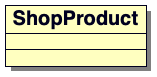

A classe é dividida em três seções, com o mome exibido na primeira. As linhas divisórias são opcionais, quando não se apresenta mais informações do que o nome da classe. É o suficiente para algumas classes. Não há obrigação de representar cada campo e método, ou, até mesmo, cada classe em um diagrama de classe.

Classes abstratas são representadas pelo nome da classe em itálico ou adicionando-se `{abstract}` ao nome da classe:


| ShopProductWriter {abstract} |
| -------------------- |
|  |
|  |

Interfaces são definidas da mesma forma que classes, exceto pelo fato de que devem incluir um "esteriótipo", isto é, uma extensão da UML:

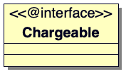

###### Atributos

De forma geral, os atributos descrevem as propriedades de uma classe. Atributos são listados na seção diretamente abaixo do nome da classe:

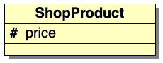

O símbolo inicial representa o nível de visibilidade, de controle de acesso, para o atributo. Existem três tipos disponíveis:

| Símbolo | Visibilidade | Explicação |
| ---------- | ---------- | ---------- |
| + | Pública | Disponível para todo mundo. |
| - | Privada | Disponível na classe corrente apenas. |
| # | Protegida | Disponível na classe corrente e suas subclasses apenas. |

O símbolo da visibilidade é seguido pelo nome do atributo. Nesse caso, descreve-se a propriedade `ShopProduct::$price`. Dois pontos são usados para separar o nome do atributo do seu tipo, e opcionalmente, seu valor padrão.

###### Operações

Operações descrevem métodos, ou, mais apropriadamente, descrevem as chamadas que podem ser feitas sobre uma instância de uma classe:

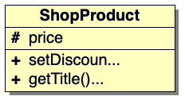

Como se pode ver, operaçnoes usam uma sintaxe semelhante à usada pelos atributos. O símbolo de visibilidade precede o nome do método. Uma lista de parâmetros fica entre parênteses. O tipo de retorno do método, se houver algum, é delimitado por dois pontos. Parâmetros são muitas vezes representados apenas pelo seu tipo, já que o nome do argumento geralmente não é significativo.

###### Descrevendo herança e implementação

A UML descreve o relacionamento de herança como "generalização". Este relacionamento é representado por uma linha, indo de uma subclasse para sua classe-mãe. A linha possui uma flecha fechada vazia.

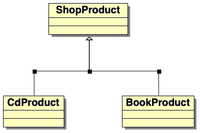

A UML descreve o relacionamento entre as interfaces e as classes que as implementam como "realização". Veja a classe `ShopProduct` fosse implementar a interface `Chargeable`: 

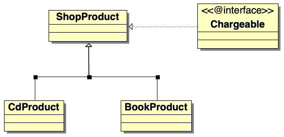

###### Associações

A herança é apenas um entre um rande número de relacionamentos em um sistema orientado a objetos. Uma associação ocorre quando uma propriedade de classe é declarada para armazenar uma referência a uma instância (ou instâncias) de outra classe.

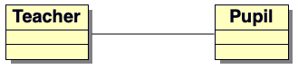

Nesse estágio, a natureza do relacionamento é vaga. Só está especificado que um objeto `Teacher` terá uma referência a um ou mais objetos `Pupil`, ou vice-versa. Esse relacionamento pode ou não ser recíproco.

Pode-se usar setas para descrever a direção da associação. A classe `Teacher`, agora, possui uma instância da classe `Pupil`, mas não o contrário, e a flecha leva a classe `Teacher` para a `Pupil`. Essa associação é chamada de "unidirecional".

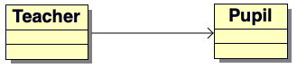

Se cada classe possuir uma referência à outra, pode-se usar uma flecha com duas pontas para descrever um relacionamento "bidirecional".

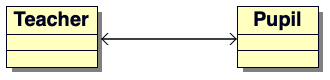

Pode-se especificar o número de instâncias de uma classe que são referênciadas por outra em uma associação. Isso é feito colocando um número ou faixa ao lado de cada classe. Também, pode-se usar `*`, indicando qualquer número de objetos `Pupil`:

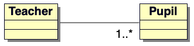

Pode haver um objeto `Teacher` e de cinco a dez objetos `Pupil` na associação:

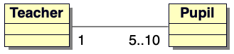

###### Agregação e composição

Agregação e composição são semelhantes à associação. Todas descrevem uma situação na qual uma classe possui uma referência permanente a uma ou mais instâncias de outra. Com agregação e composição, entretanto, as instâncias referênciadas formam uma parte intrínseca do objeto.

No caso da agregação, os objetos contidos são parte central do contêiner, mas, também, podem ficar guardados por outros objetos ao mesmo tempo. O relacionamento de agregação é ilustrado por uma linha que começa com um sinal de diamante não preenchido.

Aqui, a classe `SchoolClass` agrega `Pupil`:

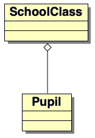

`Pupil` constitui uma classe, mas o mesmo objeto `Pupil` pode ser referido por diferentes instâncias de `SchoolClass` ao mesmo tempo. Dissolver uma classe `School` não implica necessariamente em excluir o `Pupil`, que pode atender a outras classes.

A composição representa um relacionamento ainda mais forte do que este. Na composição, o objeto contido pode ser referenciado apenas pelo seu contêiner. Ele deve ser excluído quando o contêiner também o é. Relacionamentos de composição são exibidos da mesma forma que os relacionamentos de agregação, exceto pelo fato de que o sinal de diamante deve ser preenchido. Abaixo, uma classe `Person` mantém uma referência a um objeto `SocialSecurityData`. A instância contida pode pertencer apenas ao objeto que contém `Person`.

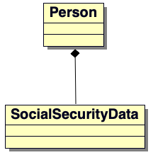

###### Descrevendo uso

O relacionamento de uso é descrito como uma dependência da UML. É o mais transiente dos relacionamentos discutidos nesta seção, pois não descreve uma conexão permanente entre classes.

Uma classe usada pode ser passada como um argumento ou obtido como um resultado de uma chamada de método.

A classe `Report` usa um objeto `ShopProductWriter`. Ele não mantém, no entanto, tal referência como uma propriedade, da mesma forma que um objeto `ShopProductWriter` mantém uma matriz de objetos `ShopProduct`:

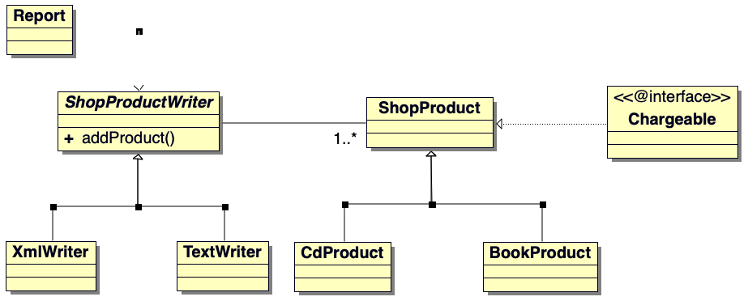

###### Usando notas

Uma nota consiste em uma caixa com um canto dobrado. Muitas vezes, ela contém trechos de pseudocódigos.

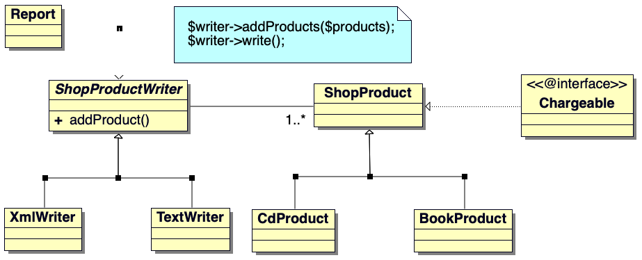

Isso clareia o diagrama. Pode-se ver que o objeto `Report` usa um `ShopProductWriter` para mostrar dados do produto.

##### Diagramas de sequência

Um diagrama de sequência é baseado em objetos, e não em classes. Ele é usado para modelar um processo em um sistema passo a passo.

Um diagrama de sequência apresenta os participantes de um sistema de esquerda para a direita. Aqui, um diagrama simples, modelando os meios pelos quais um objeto `Report` grava dados do produto:


Rotula-se os objetos apenas com nomes de classes. Só no caso de haver mais de uma instância da mesma classe trabalhando independentemente no diagrama é que se inclui um nome de objeto no formato rótulo:classe (product1:ShopProduct, por exemplo).

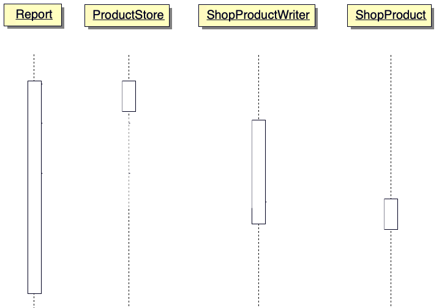

As linhas verticais quebradas representam o tempo de vida dos objetos no sistema. As caixas maiores, que seguem as linhas de tempo, representam o foco de um processo. Ler o diagrama de cima para baixo mostra como o processo se move entre os objetos do sistema. Fica mais fácil de observar com as mensagens passadas entre os objetos.

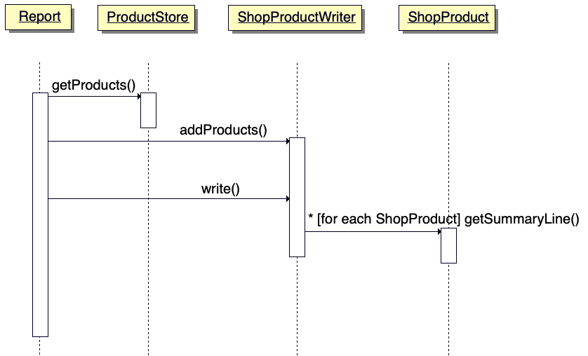

As flechas representam as mensagens enviadas de um objeto para outro. Valores de retorno são, muitas vezes, implícitos. Cada mensagem é rotulada usando a chamada de método relevante. Pode-se agir com flexibilidade no uso dos rótulos, embora haja uma sintaxe. Assim:

```php
[okToPrint]
write()
```

Esse código significa que a chamada `write()` só deve ser feita se a condição correta for satisfeita. Um asterisco é usado para indicar uma repetição, opcionalmente com mais esclarecimento entre colchetes:

```php
*[for each ShopProduct]
write()
```

Assim, lendo de cima para baixo, o objeto `Report` obtém uma lista de objetos `ShopProduct` a partir de um objeto `ProductStore`. Ele os passa para um objeto `ShopProductWriter`, que armazena referências. O objeto `ShopProductWriter` chama `ShopProduct::getSummaryLine()` para cada objeto `ShopProduct` que ele referencia, adicionando o resultado à sua saída.

Diagramas de sequência podem modelar processos, congelando fatias de interação dinâmica e as apresentando com surpreendente clareza.

## Padrões

A comunidade de programadores trabalha, em conjunto, na maior parte dos problemas encontrados. Padrões de projeto podem fornecer os meios para extrair conhecimento com o qual se resolve esses problemas. Assim, que um padrão torna-se comum, ele enriquece a linguagem, facilitando o compartilhamento de ideias de projeto e suas consequências. Padrões de projeto, simplesmente, destilam problemas comuns, definem soluções testadas e descrevem prováveis resultados.

### O que são padrões de projeto?

No mundo do software, um padrão é uma manifestação tangível da memória tribal de uma organização.

[Um padrão é] uma solução de um problema em contexto.

Um padrão de projeto é um problema analisado e uma boa prática para sua solução explicada. Problemas tendem a ser recorrentes e devem ser resolvidos sempre que ocorrem.

Padrões de projeto descrevem e formalizam esses problemas e soluções, tornando a experiência, obtida a duras penas, disponível para uma comunidade maior de programação. Os padrões são (ou devem ser) basicamente *bottom-up* e não *top-down*. Eles são enraizado na prática, e não na teoria. Porém, isso não significa que não existe um forte elemento teórico para os padrões de projeto; apenas que os padrões são baseados em técnicas do mundo real, usadas por programadores reais. Martin Fowler diz que ele descobre padrões, não os inventa.

Um catálogo de padrões não é um livro de receitas. Padrões de projeto descrevem abordagens para determinados problemas. Os detalhes da implementação podem variar enormemente de acordo com o contexto, que pode incluir a linguagem, a natureza da aplicação, o tamanho do projeto e as especificidades do problema.

Nomear um padrão é valioso. Ele fornece o tipo de vocabulário comum que surgiu, naturalmente, com o passar dos anos, nas profissões e ofícios mais antigos. Tal prática ajuda bastante o projeto colaborativo, como abordagens alternativas, e suas consequências são testadas.

> *"Cada padrão descreve um problema que ocorre várias vezes em nosso ambiente e, então, descreve o núcleo da solução para esse problema, de forma que você possa usar essa solução um milhão de vezes, sem fazê-lo da mesma forma."* - Christopher Alexander

O enfoque aqui se concentra na forma descrita em *Design Patterns: Elements of Reusable Object-Oriented Software* de Erich Gamma, Richard Helm, Ralph Johnson e John Vlissides, mais conhecidos como *Gang of Four*.

### Uma visão geral do padrão de projetos

No fundo, um padrão de projeto consiste em quatro partes.

#### Nome

Nomes são importantes, eles enriquecem a linguagem dos programadores. Algumas poucas palavras curtas resumem problemas e soluções complexos. Eles devem balancear brevidade e descrição.

*Nomes de padrões são cruciais, porque parte do propósito dos padrões é criar um vocabulário que permita ao desenvolvedor se comunicar mais eficazmente.* - Martin Fowler.

#### O problema

Não importa o quão elegante é a solução, o problema e seu contexto são a base de um padrão. Reconhecer um problema é mais difícil do que aplicar as soluções de um catálogo de padrões. Esta é uma razão pela qual algumas soluções de padrões podem ser mal aplicadas ou usadas em excesso.

Padrões descrevem um problema com muito cuidado. Ele é descrito brevemente e, então, contextualizando, muitas vezes, com um exemplo típico e um ou mais diagramas. Ele é dividido nas suas especificações, em suas várias manifestações. Quaisquer sinais de aviso que possam ajudar na identificação do problema são descritos.

#### A solução

A solução é resumida, inicialmente, em conjunto com o problema. Ela, também, é descrita em detalhes, muitas vezes usando diagramas de interação e de classes UML. O padrão geralmente inclui um exemplo de código.

Embora o código possa ser apresentado, a solução nunca é recortar e colar. O padrão descreve uma abordagem para um problema. Podem existir centenas de nuances na implementação.

Martin Fowler refere-se às soluções nos padrões como "cozidas pela metade", ou seja, o codificador deve pegar o conceito e terminá-lo ele próprio.

#### Consequências

Cada decisão terá consequências mais amplas. Isso deve incluir a resolução satisfatória do problema em questão, é claro. Uma soluçnao, uma vez distribuída, pode ser idealmente apropriada para funcionar com outros padrões. Porém, também pode haver perigos a serem observados.

### O formato Gang of Four

Pelo fato de o livro da *Gang of Four* ter tanta influência, e pela abordagem de muitos dos padrões que eles descrevem, será examinado algumas das seções que eles incluem nos seus padrões:

- Intenção: uma declaração breve do propósito do padrão. Deve-se ser capaz de entender o motivo do padrão rapidamente;
- Motivação: o problema descrito muitas vezes em termos de uma situação típica;
- Aplicabilidade: um exame das diferentes situações nas quais pode-se aplicar o padrão. Enquanto que a motivação descreve um problema típico, esta seção define situações específicas e pesa os méritos da solução no contexto de cada uma;
- Estrutura/Interação: essas seções podem conter diagramas de interação e de classe UML descrevendo os relacionamentos entre classes e objetos na solução;
- Implementação: essa seção examina os detalhes da solução e quaisquer questões que possam surgir durante a aplicação da técnica, fornecendo dicas para a distribuição;
- Código exemplo: um código de exemplo simples muitas vezes fornece uma caminho para um padrão. O exemplo é muitas vezes limitado ao básico para deixar a solução à vista;
- Usos conhecidos: sistemas reais nos quais o padrão (problema, contexto e solução) ocorre. Há quem diga que, para um padrão ser genuíno, ele deve ser encontrado em pelo menos três contextos publicamente disponíveis; lei às vezes chamada "regra de três";
- Padrões relacionados: alguns padrões implicam outros. Na aplicação de uma solução, pode-se criar o contexto no qual outro torna-se útil. Essa seção examina tais sinergias e, também, discute padrões que possuam similaridades quanto ao problema, além de alguns antecedentes: padrões definidos em algum outro lugar sobre os quais o padrão corrente é construído.

### Por que usar padrões de projeto?

#### Um padrão de projeto define um problema

Definindo problemas comuns, os padrões podem auxiliar a melhorar um projeto.

#### Um padrão de projeto define uma solução

Após definir e reconhecer o problema, um padrão oferece uma solução, junto a uma análise das consequências do seu uso.

#### Padrões de projeto são independentes de linguagem

Padrões definem objetos e soluções em termos orientados a objetos. Isso significa que muitos padrões aplicam-se igualmente em mais de uma linguagem. Outros se transferem com modificações à aplicabilidade ou consequências do padrão, mas permanecem válidos.

#### Padrões definem um vocabulário

Fornecendo aos desenvolvedores nomes para as técnicas, os padrões tornam a comunicação mais rica.

Sem uma linguagem de padrões, ainda assim pode-se usar outras técnicas. Elas precedem a sua nomelcatura e organização. Se os padrões não existissem, eles evoluiriam sozinhos. Qualquer ferramenta que seja usada suficientemente acabará adquirindo um nome.

#### Padrões são experimentados e testados

Assim, se os padrões documentam uma boa prática, a nomeclatura é a única coisa verdadeiramente original no catálogo de padrões? Em algum sentido, isso parece ser verdade. Padrões representam a melhor prática em um contexto orientado a objetos. Mesmo que parece algum exercício de reafirmar o óbvio, os padrões fornecem acesso a problemas e soluções que de outra forma seria descoberto do modo mais difícil.

Os padrões tornam o projeto acessível. 

#### Padrões são projetados para colaboração

Pela sua natureza, os padrões devem ser geradores e passíveis de composição. Isso significa que se deve ser capaz de aplicar um padrão e, por meio dele, criar condições apropriadas para a aplicação de outro.

Catálogos de padrões são, geralmente, projetados com esse tipo de colaboração em mente; o potencial para a composição de padrões é sempre documentado no próprio padrão.

#### Padrões de projeto promovem um bom projeto

Padrões de projeto demonstram e aplicam princípios de projeto orientado a objetos. Assim, um estudo de projetos de padrão pode produzir mais do que uma solução específica em um contexto. Pode-se obter uma nova perspectiva sobre as formas pelas quais objetos e classes podem ser combinados para alcançar um objetivo.

## Alguns princípios sobre padrões
- Gerando objetos
- Projetando relações de objetos

## Prática
- A boa (e a má) prática
- Uma introdução ao PEAR
- Gerando documentação com o phpDocumentor
- Controle de versões com CVS
- Construção automática com Phing

## Conclusão
- Objetos, padrões e prática

## Apêndices
- Referências
- Uma analisador simples
